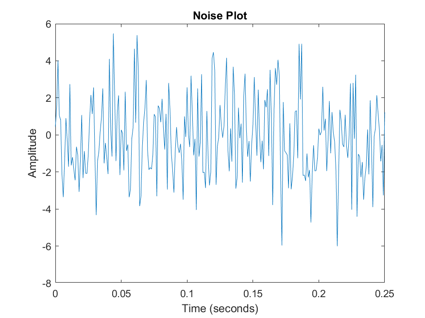

# CPE-322 Repository
### *By Miguel Rodriguez*
---
> **Future Projects will be posted on here once they are completed**
> 
---
  ~~0. GitHub Repository~~
- Due: Jan. 27th @ 11:59 PM
1. GHDL and GTKWave
- Due: Feb. 3rd @ 11:59 PM
2. Command Line
3. Python
4. Django and Flask
5. Paho-MQTT
6. Node.js and Pystache
7. ThingSpeak and Google Sheets
8. Data Analysis
9. YANG
10. BLockchain

`code`

[Team Project Website](https://begonia-prism-5lls.squarespace.com/)

